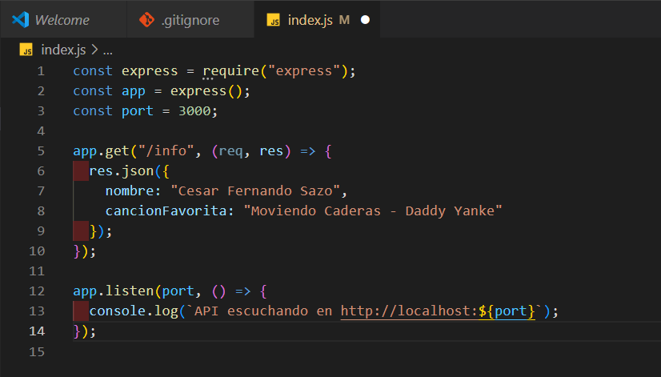
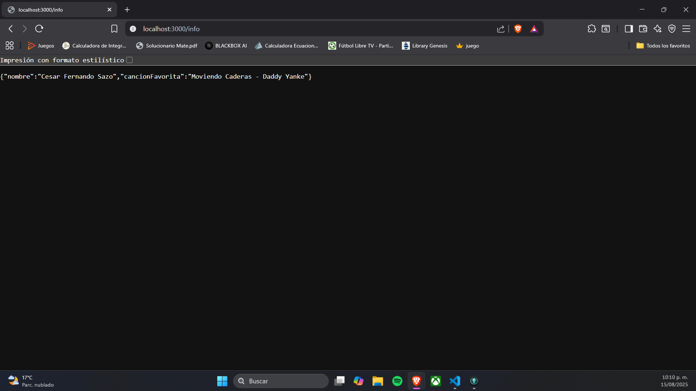
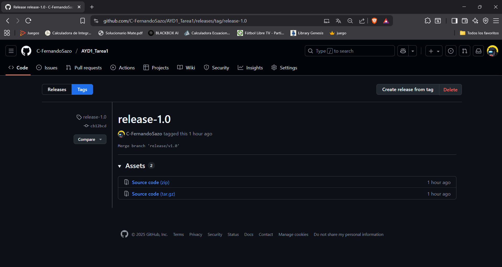
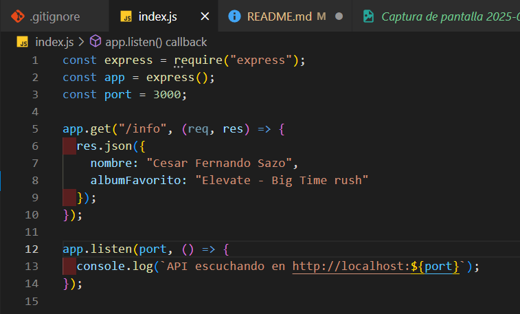
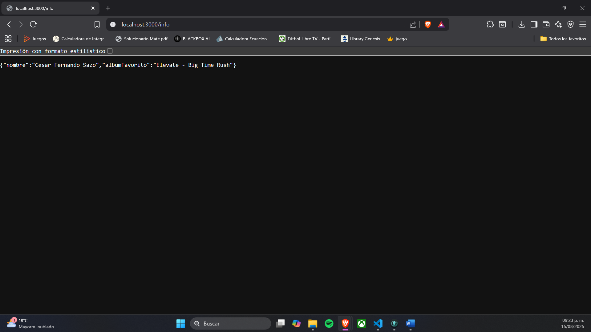
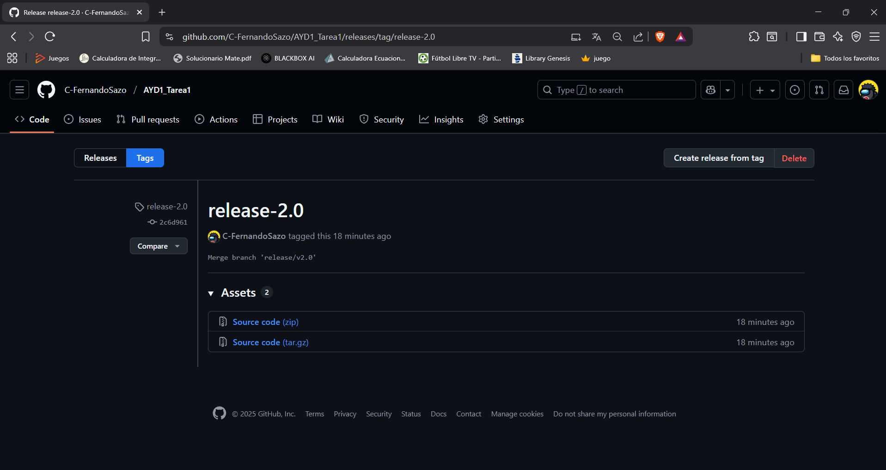
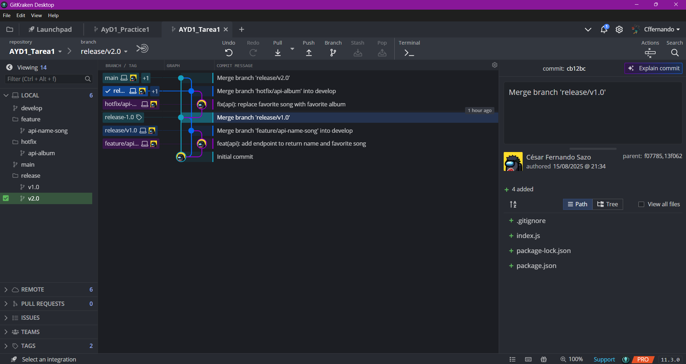
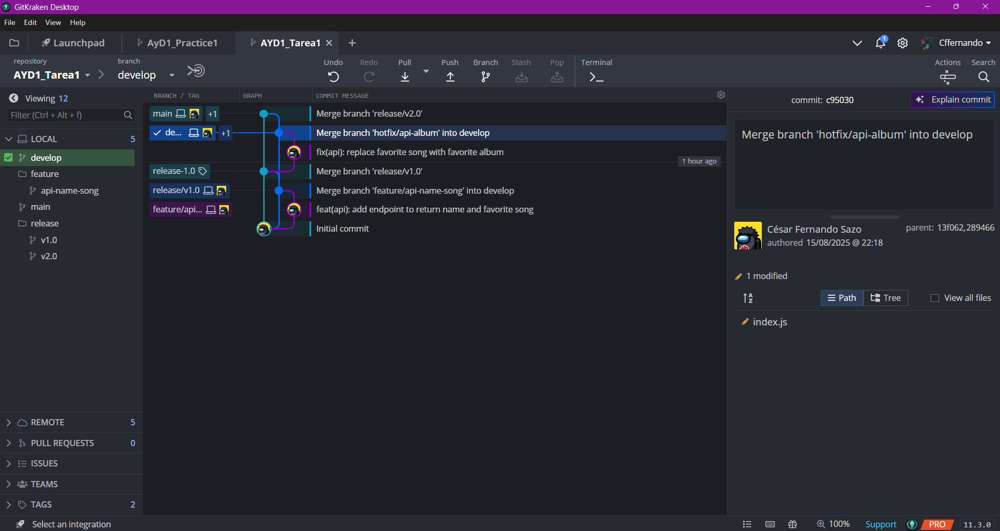

# Tarea1 - 15 de Agosto de 2025

# Datos Estudiante

| Nombre                   | Registro Académico |
|---------------------------|--------------------|
| Cesar Fernando Sazo Quisquinay | 202202906          |

## API Rest que muestre nombre y el nombre de canción favorita

## Generando TAG de versión "release-1.0" para marcar esta version inicial

## Se creo una rama hotfix para corregir un error, en lugar de mostrar la canción favorita, debia mostrarse el album favorito

## Generando TAG de versión "release-2.0" para marcar esta version corregida y nueva

## Visualización de ramas en GitKraken

## Eliminando rama hotfix
